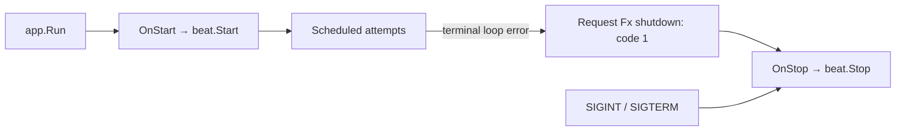

# beatfx

[](https://pkg.go.dev/github.com/uchaloop/beatfx) [](https://github.com/uchaloop/beatfx/actions/workflows/ci.yml) [](https://github.com/uchaloop/beatfx/tags) [](LICENSE)

[Install](#installation) · [Quick start](#quick-start) · [Lifecycle](#how-it-works) · [Configuration](#recommended-configuration) · [Examples](#documentation)

Optional Uber Fx lifecycle integration for [beat](https://github.com/uchaloop/beat).
This independent module owns the Fx dependency; beat itself does not.

## Installation

Requires Go 1.27 or later.

```sh
go get github.com/uchaloop/beatfx@v0.1.0
```

## Quick start

```go
package main

import (
    "context"
    "time"

    "github.com/uchaloop/beat"
    "github.com/uchaloop/beatfx"
    "github.com/uchaloop/job"
    "go.uber.org/fx"
)

func main() {
    fx.New(
        fx.Supply(beat.Config{Period: 5 * time.Minute, Jitter: 30 * time.Second}),
        fx.Provide(func() (*job.Runner, error) {
            return job.MakeRunner(
                job.Config{Timeout: 4 * time.Minute},
                func(ctx context.Context) (int64, error) {
                    // Replace with one batch of application work.
                    return 0, ctx.Err()
                },
            )
        }),
        beatfx.Module(beat.WithGracefulStop()),
        fx.StopTimeout(5 * time.Minute),
    ).Run()
}
```

The application can instead provide the Runner using the separate jobfx module.
beatfx requires only the Runner value, not that specific adapter.

`Module` requires beat.Config and *job.Runner. beat.Handler and one ordered
beatfx.Options slice are optional. A container Handler is the default; explicit
WithHandler options override it. Static options precede container options.
Use one Module per application.

## How it works



| Event | Behaviour |
|---|---|
| Attempt returns an error | Continue the schedule |
| Another cluster owns the point | Skip this point |
| Loop cannot continue | Request application shutdown with code 1 |
| Application shuts down | Stop scheduling; cancel or drain accepted work |

Startup starts the scheduler. Shutdown stops scheduling and drains or cancels
work according to beat's options. Ordinary attempt errors do not stop the daemon.
If the scheduling loop terminates unexpectedly, beatfx requests Fx shutdown with
exit code 1. app.Run handles this automatically. Applications driving Start/Stop
manually must receive app.Wait and call Stop themselves. The original loop error
is returned by beat.Stop through the shutdown hook.

## Documentation

[API reference on pkg.go.dev](https://pkg.go.dev/github.com/uchaloop/beatfx)

## Recommended configuration

> [!TIP]
> We recommend [confmaker](https://github.com/uchaloop/confmaker) for typed ENV
> configuration and [confx](https://github.com/uchaloop/confx) for its Fx integration.
> Configuration loading stays in the application; it is optional for the work libraries.

<details>
<summary><strong>Configure from ENV with confmaker / confx</strong></summary>

Replace `fx.Supply(beat.Config{...})` in the quick start with these Fx options:

```go
confx.Module(),
confx.Provide[beat.Config](),
```

Import `github.com/uchaloop/confx`. Include `confx.Module()` once, even when
registering several config types. Keep the work constructor and adapter Module.

`BEAT_PERIOD=5m BEAT_JITTER=30s` fills beat.Config. To load the Runner timeout
as well, add `confx.Provide[job.Config]()` and have its constructor accept
`cfg job.Config` instead of constructing that value inline.

</details>

## Related libraries

| Library | Purpose |
|---|---|
| [beat](https://github.com/uchaloop/beat) | Scheduling and shutdown contracts |
| [jobfx](https://github.com/uchaloop/jobfx) | An optional way to provide the Runner |

## Acknowledgements

Thanks to the authors and maintainers of [Uber Fx](https://github.com/uber-go/fx)
for dependency injection and lifecycle primitives that make this adapter possible.

## License

[MIT](LICENSE)
